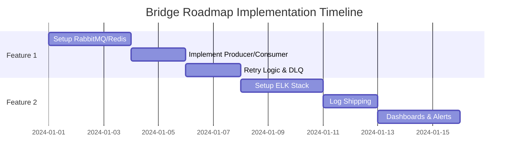

# Bridge Roadmap: <EPIC-SLUG>

## Resumen

**Epic objetivo**: <EPIC-NOMBRE>
**Estado de conectividad**: Parcialmente conectado
**Objetivo del bridge**: Construir prerequisitos faltantes para conectar el epic al codebase

## Features Puente

### Feature 1: Implementar Async Queue

**Descripción**: Implementar sistema de colas para procesamiento de jobs en background

**Alcance**:

- Setup de RabbitMQ/Redis
- Implementar producer/consumer pattern
- Configurar retry logic
- Implementar dead letter queue

**Criterios de Aceptación**:

- [ ] RabbitMQ/Redis configurado y corriendo
- [ ] Producer puede publicar mensajes en la cola
- [ ] Consumer puede procesar mensajes de la cola
- [ ] Retry logic implementado (3 intentos con backoff exponencial)
- [ ] Dead letter queue configurada para mensajes fallidos
- [ ] Monitoring de cola (queue depth, processing rate)

**Estimación**: 5 puntos (1 semana)

**Dependencias**: Ninguna

**Archivos que toca**:

- `infra/docker-compose.yml` (agregar RabbitMQ/Redis)
- `src/queue/producer.ts` (nuevo)
- `src/queue/consumer.ts` (nuevo)
- `src/queue/config.ts` (nuevo)

---

### Feature 2: Mejorar Monitoring

**Descripción**: Implementar stack de monitoring centralizado (ELK)

**Alcance**:

- Setup de Elasticsearch, Logstash, Kibana
- Configurar log shipping desde aplicación
- Implementar dashboards en Kibana
- Configurar alertas

**Criterios de Aceptación**:

- [ ] ELK stack configurado y corriendo
- [ ] Logs de aplicación se envían a Elasticsearch
- [ ] Dashboards creados en Kibana (errors, requests, performance)
- [ ] Alertas configuradas (error rate > 5%, latency > 500ms)
- [ ] Retention policy configurada (30 días)

**Estimación**: 8 puntos (2 semanas)

**Dependencias**: Feature 1 (Async Queue)

**Archivos que toca**:

- `infra/docker-compose.yml` (agregar ELK)
- `src/logging/elk-transport.ts` (nuevo)
- `src/logging/config.ts` (modificar)
- `infra/kibana/dashboards/*.json` (nuevo)

---

## Secuencia de Implementación

**Orden recomendado**:

1. Feature 1 (Async Queue) - Semana 1
2. Feature 2 (Monitoring) - Semana 2-3

**Paralelización**: No recomendada (Feature 2 depende de Feature 1)

## Trade-offs

### Opción A: Implementar bridge completo (recomendado)

- **Ventajas**: Epic completamente conectado, infraestructura robusta
- **Desventajas**: 3 semanas de inversión antes de implementar epic
- **Riesgos**: Bajos, tecnologías probadas

### Opción B: Implementar bridge mínimo

- **Ventajas**: 1 semana de inversión, epic puede empezar antes
- **Desventajas**: Infraestructura mínima, technical debt acumulado
- **Riesgos**: Medios, puede requerir refactorización futuro

### Opción C: Modificar epic para evitar prerequisitos

- **Ventajas**: Sin inversión en infraestructura
- **Desventajas**: Epic comprometido, funcionalidad reducida
- **Riesgos**: Altos, puede no cumplir objetivos de negocio

## Recomendación

**Opción seleccionada**: A (Implementar bridge completo)

**Justificación**:

- Epic requiere infraestructura robusta para escalabilidad
- Inversión de 3 semanas es aceptable dado el valor del epic
- Infraestructura reutilizable para futuros epics

## Próximos Pasos

1. ✅ Aprobar bridge roadmap
2. [ ] Implementar Feature 1 (Async Queue)
3. [ ] Implementar Feature 2 (Monitoring)
4. [ ] Validar bridge (tests de integración)
5. [ ] Retomar implementación del epic original

---

**Documento generado**: <FECHA>
**Ready for**: implementar-bridge
