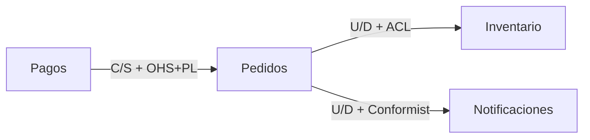
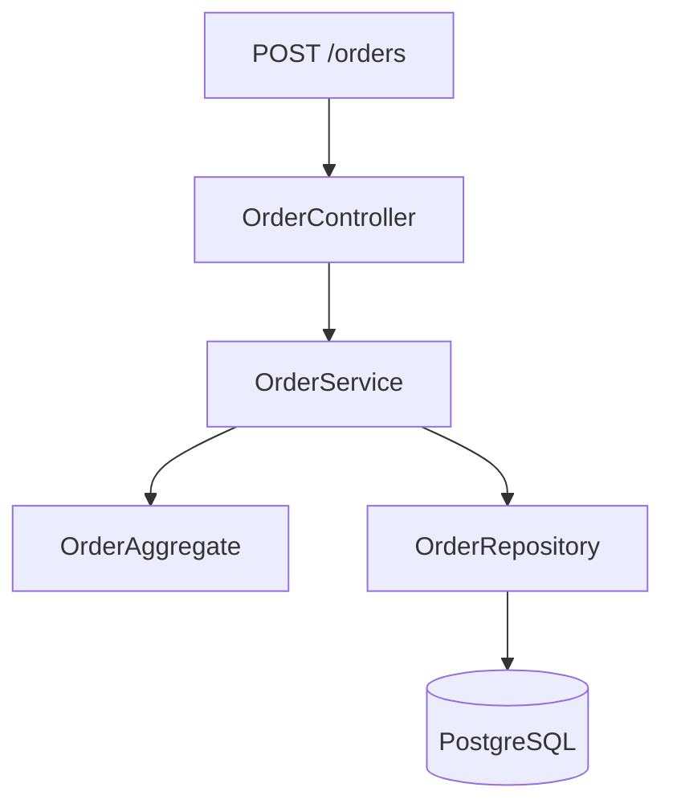

# Ejemplos de mapa de dominio — Sistema de Checkout E-commerce

Este documento contiene ejemplos completos basados en un sistema de checkout de e-commerce para ilustrar cómo completar cada sección de los templates de mapa de dominio.

## Contexto y alcance

**Ejemplo:**

- **mapState:** `AS_IS`
- **Producto:** Sistema de checkout de e-commerce
- **Fuentes:** `src/checkout`, `src/payments`, `src/inventory`, documentación de API, tickets JIRA
- **splitMode:** `by-domain` (dividido por subdominios)
- **Fuera de alcance:** Sistema de catálogo de productos, módulo de usuarios/perfil, analytics y reporting

## Lectura rápida

**Ejemplo:**
El dominio de checkout coordina la conversión de intención de compra en pedidos confirmados mediante la orquestación de pagos, reservas de inventario y notificaciones, con el contexto de Pagos como upstream crítico mediante relación CustomerSupplier con rol OHS+PL. Pendiente: definir estrategia de retries para fallos transitorios en el gateway de pagos.

## Subdominios (espacio de problema)

**Ejemplo:**

- **Gestión de Pedidos** (Núcleo)
  - Problema que cubre: Coordinar el ciclo de vida completo de pedidos desde creación hasta entrega
  - Evidencia: `src/orders/`, `src/checkout/`, 45 tickets JIRA, documentación de negocio
  - Notas/tensiones: Tensión: límites con inventario para reservas vs confirmaciones

- **Procesamiento de Pagos** (Núcleo)
  - Problema que cubre: Ejecutar transacciones de pago con múltiples proveedores y gestionar conciliación
  - Evidencia: `src/payments/`, integraciones Stripe/PayPal, SLAs de negocio
  - Notas/tensiones: Alta volatilidad por cambios en proveedores de pago

- **Gestión de Inventario** (Soporte)
  - Problema que cubre: Mantener disponibilidad de productos y coordinar reservas
  - Evidencia: `src/inventory/`, eventos de stock, warehouse management
  - Notas/tensiones: Dependencia crítica con pedidos pero no diferenciador competitivo

- **Notificaciones** (Genérico)
  - Problema que cubre: Enviar comunicaciones transaccionales a clientes
  - Evidencia: `src/notifications/`, servicios de email/SMS
  - Notas/tensiones: Podría reemplazarse por SaaS externo

### Criterios de clasificación usados

**Ejemplo:**

- **Núcleo:** Áreas que representan diferenciación competitiva directa y valor estratégico para el negocio (Pedidos, Pagos)
- **Soporte:** Áreas necesarias para el funcionamiento pero no diferenciadoras (Inventario)
- **Genérico:** Áreas con soluciones commodity que podrían externalizarse (Notificaciones)

## Canvas de Bounded Context (Núcleo: completo)

**Ejemplo — Contexto Pedidos:**

- **Propósito**: Coordinar el ciclo de vida completo de pedidos desde intención de compra hasta entrega final, asegurando consistencia de estado y trazabilidad
- **Clasificación estratégica**: Núcleo (Core)
- **Evolución**: custom (altamente especializado para nuestro modelo de negocio)
- **Subdominio(s)**: Gestión de Pedidos
- **Límites — dentro**: Creación de pedidos, gestión de estados, cálculo de totales, coordinación con pagos e inventario
- **Límites — fuera**: Procesamiento de pagos (contexto separado), gestión de catálogo de productos, fulfillment físico
- **Roles de dominio**: ejecución (procesamiento), coordinación (con otros contextos), trazabilidad (auditoría)
- **Interfaz pública**: API REST para creación/consulta de pedidos, eventos de dominio para cambios de estado
- **Ownership tentativo**: Equipo de Checkout & Orders
- **Archivo dedicado**: en este archivo

### Lenguaje ubicuo

**Ejemplo para contexto de Pedidos:**

| Término | Definición en este contexto | Anti-términos |
| --------- | ----------------------------- | --------------- |
| Pedido | Entidad que representa la intención de compra confirmada, con estado y línea de items | Orden, transaction, purchase |
| Línea de pedido | Item individual dentro de un pedido con producto, cantidad y precio | OrderItem, cart item, row |
| Estado del pedido | Ciclo de vida: pending → confirmed → processing → shipped → delivered/cancelled | status, stage, phase |
| Confirmación | Acción de transicionar de pending a confirmed tras validación exitosa | validation, approval, completion |

### Comunicación de entrada / salida

**Ejemplo para contexto de Pedidos:**

- **Entrada (inbound)**
  - **Contraparte**: Checkout
  - **Tipo de mensaje**: Comando
  - **Qué fluye**: CreateOrderCommand (customerId, items[], shippingAddress)
  - **Relación**: UpstreamDownstream (Checkout → Pedidos)
  - **Contrato**: Schema JSON en `src/orders/api/schemas/create-order.json`
- **Salida (outbound)**
  - **Contraparte**: Pagos
  - **Tipo de mensaje**: Comando
  - **Qué fluye**: ProcessPaymentCommand (orderId, amount, paymentMethod)
  - **Relación**: CustomerSupplier (Pedidos → Pagos)
  - **Contrato**: OpenAPI spec en `docs/api/payments.yaml`

### Arqueología de código

**Ejemplo para contexto de Pedidos:**

- **Entrar por**: `src/orders/api/order_controller.ts` → método `createOrder()`
- **Leer después**: `src/orders/domain/order.ts` (agregado) → `src/orders/service/order_service.ts` → `src/orders/repository/order_repository.ts`
- **Fósil / trampa**: `src/orders/legacy/order_processor.ts` (nombre sugiere procesamiento pero solo contiene utilidades de formateo obsoletas)
- **Ancla de contrato**: `tests/orders/api/create_order_contract_test.ts` (prueba de contrato que valida schema de entrada/salida)

## Ficha de Bounded Context (Soporte / Genérico: corta)

**Ejemplo — Contexto Notificaciones (Genérico):**

- **Propósito**: Enviar comunicaciones transaccionales (email, SMS) a clientes sobre eventos de pedidos
- **Dentro**: Plantillas de mensajes, configuración de proveedores, cola de envío, tracking de entregas
- **Fuera**: Contenido de marketing, analytics de apertura, gestión de preferencias de usuario
- **Interfaz pública**: API para enviar notificaciones con template, destinatario y variables
- **Arqueología**: Entrar por `src/notifications/notification_service.ts`

## Relaciones de contexto (2 capas)

**Ejemplo:**

- **Upstream (U):** Pagos
- **Downstream (D):** Pedidos
- **Tipo (capa 1):** CustomerSupplier
- **Roles U / D (capa 2):** OHS+PL (U) / ACL (D)
- **Qué fluye (tipo):** Evento (PaymentProcessed), Comando (ProcessPayment)
- **Por qué (negocio):** Pedidos depende de confirmación de pago para confirmar orden; prioridades de Pedidos influyen en roadmap de Pagos
- **Riesgo:** Cambios en API de Pagos pueden romper flujo de checkout; latencia de pagos afecta conversión

## Matriz U×D

**Ejemplo:**

| ↓ U \ D → | Pagos | Pedidos | Inventario | Notificaciones |
| ---------------- | ------- | ---------- | ---------- | -------------- |
| Pagos | — | C/S+OHS+PL | — | — |
| Pedidos | — | — | U/D+ACL | U/D+Conformist |
| Inventario | — | U/D+OHS | — | — |
| Notificaciones | — | — | — | — |

## Diagrama Mermaid

**Ejemplo:**

## Historias de dominio

**Ejemplo — Confirmación de pedido exitosa:**

1. Cliente → selecciona productos y confirma compra → CarritoTemporal
2. Checkout → valida disponibilidad y reserva inventario → ReservaStock
3. Checkout → inicia proceso de pago → PaymentRequest
4. Pagos → procesa transacción con proveedor → PaymentConfirmation
5. Pedidos → crea orden confirmada → OrderConfirmed
6. Notificaciones → envía email de confirmación → NotificationSent

**Ejemplo — Fallo en procesamiento de pago:**

1. Cliente → confirma compra con tarjeta → CarritoTemporal
2. Checkout → valida disponibilidad y reserva inventario → ReservaStock
3. Checkout → inicia proceso de pago → PaymentRequest
4. Pagos → recibe rechazo del proveedor (fondos insuficientes) → PaymentFailed
5. Checkout → libera reserva de inventario → StockReleased
6. Checkout → notifica error al cliente → PaymentErrorNotification
7. Carrito → restaura productos para retry → CartRestored

## Bloques estructurales

**Ejemplo para contexto de Pedidos:**

**Tabla de bloques:**

| Bloque | Responsabilidad | Rutas típicas |
| --- | --- | --- |
| API | Endpoints REST y validación inicial | `src/orders/api/` |
| Service | Orquestación de lógica de negocio | `src/orders/service/` |
| Domain | Agregados y reglas de dominio | `src/orders/domain/` |
| Repository | Persistencia y consultas | `src/orders/repository/` |

## Polisemia y glosario cruzado

**Ejemplo:**

- **Producto**
  - Contexto A: Catálogo (entidad maestra con info comercial)
  - Contexto B: Inventario (SKU con stock físico)
  - Riesgo/mitigación: Riesgo: confundir atributos comerciales con operativos. Mitigación: usar ProductId como clave foránea, mantener vocabularios separados

- **Cliente**
  - Contexto A: Usuarios (cuenta y perfil)
  - Contexto B: Pedidos (entidad relacionada)
  - Riesgo/mitigación: Riesgo: asumir misma estructura de datos. Mitigación: usar CustomerId en Pedidos, no mezclar entidades

- **Confirmación**
  - Contexto A: Pagos (transacción aprobada)
  - Contexto B: Pedidos (estado de orden)
  - Riesgo/mitigación: Riesgo: timing diferente entre eventos. Mitigación: eventos separados PaymentConfirmed vs OrderConfirmed

## Trazabilidad subdominio ↔ bounded context

**Ejemplo:**

| Subdominio | Bounded context(s) | Notas |
| --- | --- | --- |
| Gestión de Pedidos | Pedidos, Checkout | Checkout es BC de coordinación, Pedidos es BC de dominio |
| Procesamiento de Pagos | Pagos | Un BC por subdominio, alta cohesión |
| Gestión de Inventario | Inventario | Subdominio soporte con BC dedicado |
| Notificaciones | Notificaciones | Subdominio genérico externalizable |

## Decisiones de frontera

**Ejemplo:**

- **Pagos como BC separado de Pedidos**
  - Alternativa descartada: Unificar Pagos dentro de Pedidos
  - Motivo: Pagos tiene volatilidad alta (cambios en proveedores) y lógica compleja de conciliación que contaminaría el dominio de Pedidos

- **Inventario como BC de Soporte no Núcleo**
  - Alternativa descartada: Inventario como Núcleo
  - Motivo: Aunque crítico, es un commodity en nuestro modelo de negocio; no representa diferenciación competitiva directa

- **Checkout como BC de coordinación**
  - Alternativa descartada: Integrar lógica de checkout en Pedidos
  - Motivo: Checkout orquesta múltiples BCs (Pagos, Inventario, Pedidos); mezclaría responsabilidades de coordinación con dominio

## Preguntas de estudio

**Ejemplo:**

1. ¿Por qué Pagos es upstream de Pedidos si Pedidos inicia el flujo de checkout? (Respuesta: Pagos define el contrato de procesamiento y sus cambios afectan a Pedidos, pero Pedidos no influye en la planificación de Pagos)
2. ¿Qué sucede con el inventario si un pago falla después de reservar stock? (Respuesta: El contexto de Pedidos debe liberar la reserva mediante evento compensatorio, documentado en la historia de error)
3. ¿Podría Notificaciones convertirse en un servicio externo SaaS? (Respuesta: Sí, está clasificado como Genérico y su interfaz es bien definida; ver sección de Subdominios)

## Supuestos y preguntas abiertas

**Ejemplo:**

- **Supuestos:** El contexto de Inventario tiene eventual consistency de stock (no verificable desde código de Pedidos); la latencia de Pagos es < 2s en 95% de casos (basado en SLAs no medidos directamente)
- **Preguntas abiertas:** ¿Deberíamos separar Pagos en dos BC (Procesamiento vs Conciliación)? ¿El contexto de Checkout debería absorber la lógica de carrito actual?

## Evaluación de salida

**Ejemplo:**

| Criterio               | Puntuación (1–10) | Evidencia en este documento                                                   |
|------------------------|-------------------|-------------------------------------------------------------------------------|
| Navegación / estudio   | 9                 | Guía de estudio clara en 3 pasadas, índice completo cuando aplica             |
| Subdominios            | 8                 | 4 subdominios con evidencia y criterios, pero podría profundizar en tensiones |
| Canvases + arqueología | 9                 | BCs Núcleo con canvas completo + arqueología detallada, Soporte con fichas    |
| Mapas de contexto      | 8                 | 2 mapas por perspectiva con relaciones 2 capas, falta matriz U×D              |
| Ejecución + bloques    | 9                 | 2 historias (feliz + error), bloques estructurales con diagrama Mermaid       |
| Lenguaje / polisemia   | 8                 | Lenguaje ubicuo en BCs, tabla de polisemia pero podría extenderse             |
| Autocontención         | 9                 | Documento autocontenido con referencias claras, sin dependencias externas     |
| **Global**             | 8.6               | promedio                                                                      |

**Listo para:** `fusionar-solo-detalles` (puntuación ≥ 9 requiere completar matriz U×D y extender polisemia)
