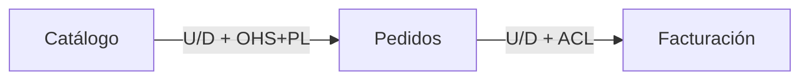
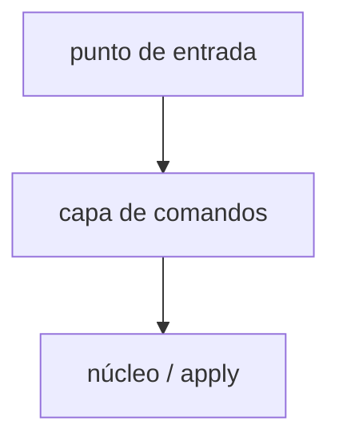

# `<nombre del dominio o producto>` — mapa de dominio (índice)

Este template es para dominios complejos que requieren división en múltiples archivos. Usa la variante `by-domain` o `by-size` cuando el dominio tenga muchos bounded contexts (>5), subdominios complejos, o requiera documentación extensa.

Este archivo es el **índice principal** (`domain-map.md`). Los cuerpos detallados van en `domain-map/<dominio-slug>.md` y los canvases pesados en `domain-map/bc-<contexto-slug>.md`.

## Checklist de secciones mínimas

- [ ] Contexto y alcance (`mapState`, fuentes, fuera de alcance)
- [ ] Lectura rápida + Guía de estudio
- [ ] Índice de partes (enlaces a archivos divididos)
- [ ] Visión global del ecosistema
- [ ] Mapas de contexto globales (≥2 perspectivas)
- [ ] Historias de dominio (≥2)
- [ ] Bloques estructurales globales
- [ ] Polisemia / trazabilidad / decisiones / preguntas de estudio / supuestos
- [ ] Evaluación de salida + un `Listo para`

---

## Contexto y alcance

- **mapState:** `AS_IS` | `TO_BE`
- Producto/áreas; fuentes; `splitMode` (by-domain | by-size); qué queda fuera.

## Lectura rápida

- Dominio en una frase.
- Contextos / mapas clave.
- Relación más sensible (tipo + roles).
- Pendientes.

## Guía de estudio

1. **Pasada 1 (~5 min)**: Lectura rápida + historias + 1 mapa runtime
   - Objetivo: Entender el flujo
2. **Pasada 2 (~20 min)**: Índice de partes + subdominios + BCs Núcleo (+ arqueología)
   - Objetivo: Límites y código de entrada
3. **Pasada 3 (~40 min)**: Resto de mapas, bloques, polisemia, evaluación
   - Objetivo: Cuestionar fronteras

## Índice de partes

- [`domain-map/<dominio-slug>.md`](./domain-map/<dominio-slug>.md)
  - Alcance: Dominio …
  - Contenido principal: …

## Visión global

Una frase del ecosistema y por qué se partió el archivo.

## Mapas de contexto globales (por perspectiva)

### Pregunta 1 — `<…>` (perspectiva: `<runtime|modelo|semántica|planificación|ownership>`)

#### Leyenda aplicada

Solo tipos (capa 1) y roles (capa 2) usados en este mapa.

#### Relaciones (2 capas)

- **Upstream (U)**
- **Downstream (D)**
- **Tipo (capa 1)**: UpstreamDownstream / CustomerSupplier / Partnership / SharedKernel / SeparateWays / BigBallOfMud
- **Roles U / D (capa 2)**: p. ej. OHS+PL / ACL
- **Qué fluye (tipo)**: comando / consulta / evento / documento/archivo / modelo
- **Por qué (negocio)**
- **Riesgo**

#### Matriz U×D (si ≥5 BCs)

- **BC-A** → BC-A: —; BC-B: ; BC-C:
- **BC-B** → BC-A: ; BC-B: —; BC-C:
- **BC-C** → BC-A: ; BC-B: ; BC-C: —

*Celdas: tipo + roles abreviados, o vacío.*

#### Diagrama (Mermaid — flecha U→D)

### Pregunta 2 — `<…>` (perspectiva: `<…>`)

#### Subestructura

Misma subestructura que Pregunta 1.

## Historias de dominio (comportamiento en ejecución)

### Historia 1 — `<nombre>` (camino feliz)

1. `<Actor>` → `<acción>` → `<artefacto>`
2. …

### Historia 2 — `<nombre>` (error / umbral)

1. …

## Bloques estructurales ligeros (estático)

> Solo puntos de entrada → módulos (máx. 2 niveles) para arqueología. **No es C4 ni context map.**

| Bloque | Responsabilidad | Rutas típicas |
|--------|-----------------|---------------|
|        |                 |               |

## Polisemia cruzada / Trazabilidad / Decisiones / Preguntas de estudio / Supuestos

### Tablas estándar

Ver sección B de cada parte.

### Referencia a evaluación de salida

Ver bloque al final de este índice.

---

## Estructura de archivos divididos

### Archivo: `domain-map/<dominio-slug>.md` (cuerpo de dominio)

Este archivo contiene el detalle de un subdominio o área específica. Debe enlazar al índice principal.

#### Estructura mínima del cuerpo de dominio

- Enlace al índice: `[Volver al índice](../domain-map.md)`
- Contexto y alcance (específico de esta parte)
- Subdominios (solo los de esta parte)
- Catálogo de bounded contexts (completo para Núcleo, ficha para Soporte)
- Mapas de contexto específicos de esta parte
- Historias de dominio específicas
- Bloques estructurales específicos
- Polisemia / trazabilidad / decisiones / preguntas / supuestos específicos

### Archivo: `domain-map/bc-<contexto-slug>.md` (canvas pesado)

Para bounded contexts muy complejos, puedes extraer su canvas a un archivo separado.

#### Estructura mínima del canvas pesado

- Enlace al cuerpo de dominio: `[Volver a <dominio>](<dominio-slug>.md)`
- Canvas completo del bounded context
- Lenguaje ubicuo detallado
- Comunicación entrada/salida extensa
- Arqueología de código detallada
- Reglas de negocio en el límite

---

## Evaluación de salida

> **`Listo para`** usa literales ES de esta skill (`fusionar-solo-detalles` | `mejorar` | `bloqueado`); no traducir.

| Criterio               | Puntuación (1–10) | Evidencia en este documento |
|------------------------|-------------------|-----------------------------|
| Navegación / estudio   |                   |                             |
| Subdominios            |                   |                             |
| Canvases + arqueología |                   |                             |
| Mapas de contexto      |                   |                             |
| Ejecución + bloques    |                   |                             |
| Lenguaje / polisemia   |                   |                             |
| Autocontención         |                   |                             |
| **Global**             |                   | promedio                    |

La puntuación global se calcula como el promedio de los criterios individuales y determina el estado `Listo para` final del documento.
