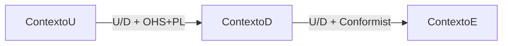
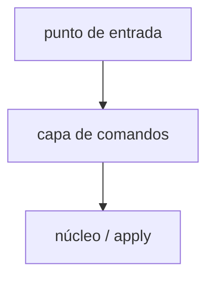

# `<nombre del dominio o producto>` — mapa de dominio

Este template es para dominios simples que pueden documentarse en un solo archivo. Usa la variante `single` cuando el dominio tenga pocos bounded contexts (≤5) y no requiera división por tamaño o complejidad.

## Checklist de secciones mínimas

- [ ] Contexto y alcance (`mapState`, fuentes, fuera de alcance)
- [ ] Lectura rápida + Guía de estudio
- [ ] Subdominios + criterios
- [ ] Catálogo BC (Núcleo completo / Soporte ficha)
- [ ] ≥2 mapas por perspectiva (leyenda + tabla 2 capas + Mermaid)
- [ ] ≥2 historias (feliz + fallo/umbral)
- [ ] Bloques estructurales ligeros
- [ ] Polisemia / trazabilidad / decisiones / preguntas de estudio / supuestos
- [ ] Evaluación de salida + un `Listo para`

---

## Contexto y alcance

- **mapState:** `AS_IS` | `TO_BE`
- Producto/áreas; fuentes; qué queda fuera.

## Lectura rápida

- Dominio en una frase.
- Contextos / mapas clave.
- Relación más sensible (tipo + roles).
- Pendientes.

## Guía de estudio

1. **Pasada 1 (~5 min)**: Lectura rápida + historias + 1 mapa runtime
   - Objetivo: Entender el flujo
2. **Pasada 2 (~20 min)**: Subdominios + BCs Núcleo (+ arqueología)
   - Objetivo: Límites y código de entrada
3. **Pasada 3 (~40 min)**: Resto de mapas, bloques, polisemia, evaluación
   - Objetivo: Cuestionar fronteras

## Visión del dominio

Descripción general del dominio y su relación con el ecosistema.

## Subdominios (espacio de problema)

| Subdominio | Tipo | Problema que cubre | Evidencia | Notas / tensiones |
| --- | --- | --- | --- | --- |
| | Núcleo (Core) / Soporte (Supporting) / Genérico (Generic) | | | |

### Criterios de clasificación usados

Explicación de por qué cada subdominio se asignó a su categoría.

## Catálogo de bounded contexts

### Canvas — `<Nombre>` (Núcleo: completo)

- **Propósito**: (lenguaje de negocio; sin detalle técnico)
- **Clasificación estratégica**: Núcleo (Core) / Soporte (Supporting) / Genérico (Generic)
- **Evolución (opcional)**: genesis / custom / product / commodity
- **Subdominio(s)**
- **Límites — dentro**
- **Límites — fuera**
- **Roles de dominio**: p. ej. ejecución, análisis, cumplimiento…
- **Interfaz pública**: Qué pueden consumir/acoplar otros contextos
- **Ownership tentativo**
- **Archivo dedicado**: en este archivo

#### Lenguaje ubicuo

| Término | Definición en este contexto | Anti-términos |
|---------|-----------------------------|---------------|
|         |                             |               |

#### Comunicación de entrada / salida

- **Entrada (inbound)**
  - Contraparte
  - Tipo de mensaje: comando / consulta / evento / documento/archivo
  - Qué fluye
  - Relación (tipo + roles)
  - Contrato / notas
- **Salida (outbound)**
  - Contraparte
  - Tipo de mensaje: comando / consulta / evento / documento/archivo
  - Qué fluye
  - Relación (tipo + roles)
  - Contrato / notas

#### Reglas de negocio en el límite

- …

#### Arqueología de código

- **Entrar por**: Símbolo / archivo de entrada
- **Leer después**: 1–3 archivos en orden
- **Fósil / trampa**: Nombre engañoso, layout muerto, indicador sutil
- **Ancla de contrato**: Prueba, schema, id de manifest, o contrato de API

#### Evidencia y supuestos

- **Evidencia:** …
- **Supuestos:** …
- **Preguntas abiertas:** …

### Ficha — `<Nombre>` (Soporte / Genérico: corta)

- **Propósito**
- **Dentro / fuera**
- **Interfaz pública (1 línea)**
- **Arqueología (1 línea)**: Entrar por …

---

## Mapas de contexto (por perspectiva)

### Pregunta — `<texto>` (perspectiva: `<runtime|modelo|semántica|planificación|ownership>`)

#### Leyenda aplicada

Solo tipos (capa 1) y roles (capa 2) usados en este mapa.

#### Relaciones (2 capas)

- **Upstream (U)**
- **Downstream (D)**
- **Tipo (capa 1)**
- **Roles U / D (capa 2)**
- **Qué fluye (tipo)**
- **Por qué (negocio)**
- **Riesgo**

#### Matriz U×D (si ≥5 BCs)

- **↓ U \ D →**: …

#### Diagrama

---

## Historias de dominio (comportamiento en ejecución)

### Historia de dominio — `<título>`

1. Actor → acción → artefacto
2. …

---

## Bloques estructurales ligeros

> **No es C4 ni context map** — solo anclas de lectura de código.

| Bloque | Responsabilidad | Rutas típicas |
| --- | --- | --- |
| | | |

---

## Polisemia y glosario cruzado

| Término | Contexto A | Contexto B | Riesgo / mitigación |
| --- | --- | --- | --- |
| | | | |

## Trazabilidad subdominio ↔ bounded context

| Subdominio | Bounded context(s) | Notas |
| --- | --- | --- |
| | | |

## Decisiones de frontera

| Decisión | Alternativa descartada | Motivo |
| --- | --- | --- |
| | | |

## Preguntas de estudio (el mapa debe permitir responderlas)

1. …
2. …
3. …

## Supuestos y preguntas abiertas

- …

## Evaluación de salida

> **`Listo para`** usa literales ES de esta skill (`fusionar-solo-detalles` | `mejorar` | `bloqueado`); no traducir.

| Criterio               | Puntuación (1–10) | Evidencia en este documento |
|------------------------|-------------------|-----------------------------|
| Navegación / estudio   |                   |                             |
| Subdominios            |                   |                             |
| Canvases + arqueología |                   |                             |
| Mapas de contexto      |                   |                             |
| Ejecución + bloques    |                   |                             |
| Lenguaje / polisemia   |                   |                             |
| Autocontención         |                   |                             |
| **Global**             |                   | promedio                    |

La puntuación global se calcula como el promedio de los criterios individuales y determina el estado `Listo para` final del documento.
